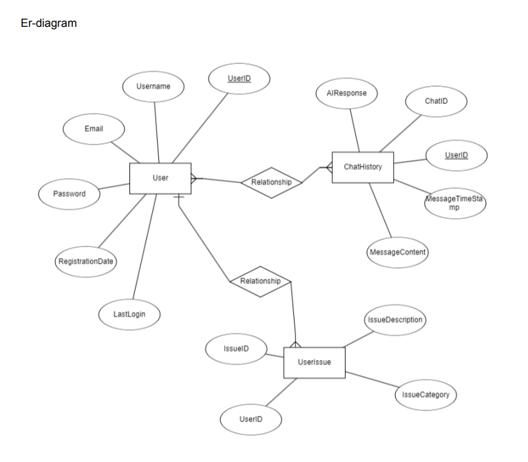
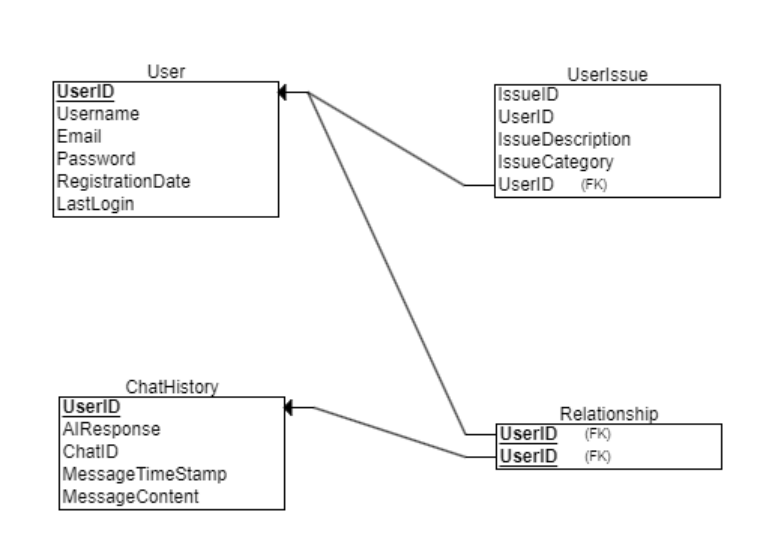
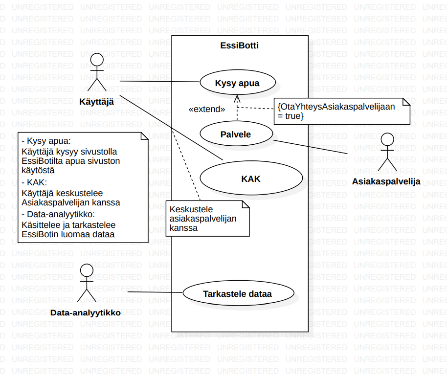

### Data Modeling

The project's data modeling includes three main tables: User, which stores user information; UserIssue, which documents issues reported by users; and ChatHistory, which records messages and AI responses in conversations between users and the chatbot.

### Use Case Diagram

 

This use case diagram represents the different actors and their interactions with the EssiBot system on the website. 
