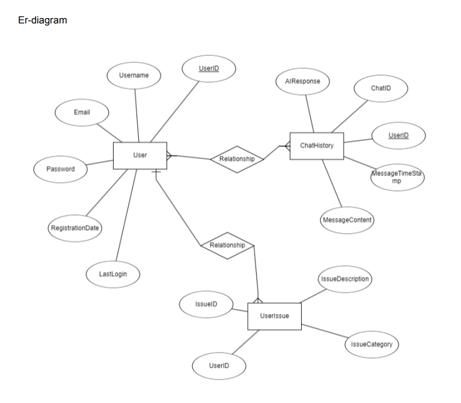
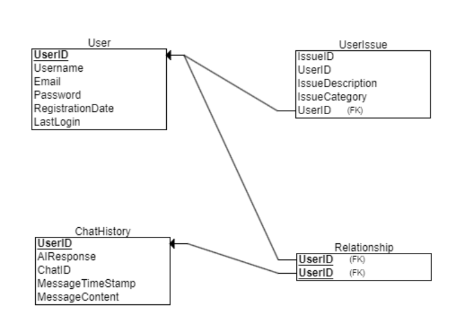
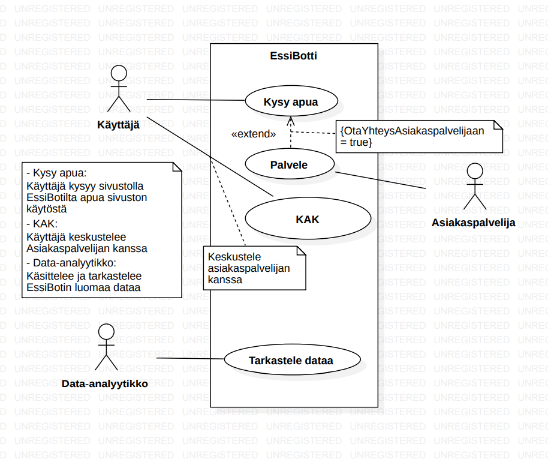

# AI Chatbot

This project is designed to create an interactive chatbot using Rasa, 

This project is designed to create an interactive chatbot using Rasa,

- **Greeting users**
- **Understanding their moods**
- **Responding to queries**

Additionally, the project includes a visualization 
component to illustrate the flow of conversation using D3.js and Dagre-D3 libraries.

## Technologies Used

### Main Technologies

- **Rasa**: An open-source framework for building conversational AI.

- **Flask**: A micro web framework used to serve the Rasa model and handle API requests.

- **MySQL**: A relational database for user data storage and authentication.

### Frontend Technologies

- **HTML/CSS:** For structuring and styling the user interface.
- **JavaScript**: To manage interactions within the chat interface.
- **D3.js**: A JavaScript library for producing dynamic, interactive data visualizations in web browsers.
- **Dagre-D3**: A D3-based library for creating directed graphs.

### Python Libraries

- **Mysql-connector-python**: To connect to the MySQL database.
- **Flask-Cors**: To handle cross-origin resource sharing for API requests.
- **Getpass**: For securely handling user passwords.

### Development Tools

- **Visual Studio Code**: Code editor for development.
- **Postman**: For testing API endpoints.
- **MySQL Workbench:** For database management.

### AI-Tools used

- **ChatGPT**

## Features

### Chatbot Functionality

- Handles various user intents, such as greetings, mood tracking, and service inquiries.
- Provides tailored responses based on user input, including positive and negative feedback paths.

### Database Integration

- User authentication is facilitated through a MySQL database.
- Secure password handling using hashing techniques to ensure user credentials are not exposed.

### Visualization

### Database Integration:

- User authentication is facilitated through a MySQL database.
- Secure password handling using `getpass` to ensure user credentials are not exposed.

### Visualization:

- An HTML page visualizes the Rasa Core conversation flow.
- Uses D3.js and Dagre-D3 for interactive and dynamic graph rendering.

### Data Modeling

The project's data modeling includes three main tables: User, which stores user information; UserIssue, which documents issues reported by users; and ChatHistory, which records messages and AI responses in conversations between users and the chatbot.

### Use case diagram

 

This use case diagram represents the different actors and their interactions with the EssiBot system on the website. 

## How to Run the Project

### Prerequisites

- Python 3.x installed on your machine.
- MySQL Server set up and running.
- Node.js installed for D3.js and Dagre-D3.

### Setup Instructions

1. **Clone the Repository:**

git clone repository-url

cd repository-folder

2. **Install Required Packages:** Create a virtual environment and activate it:

python -m venv venv

source venv/bin/activate  # For Mac/Linux

venv\Scripts\activate  # For Windows

**Install the required Python packages**:

pip install -r requirements.txt

3. **Set Up the Database**: Run the SQL scripts provided to create the necessary tables in your MySQL database.

4. **Configure Database Settings:** Update the Database/config.py file with your MySQL credentials.

5. **Run the Flask Server:** python app.py

6. **Interact with the Chatbot**: Access the chatbot via the web interface or command line.

### Visualization

Open the HTML page in your browser to view the conversation flow visualization.

## How to use Essi-bot

1. **Open the bot-window from the site**
2. **Greet the bot**
3. **The bot asks what you need help with**
4. **User will choose the subject and the bot will asnwer**

## Contributors

Samu, Mika, Samuel, Zehra, Jukka

## Ohjelmistotuotantoprojekti
